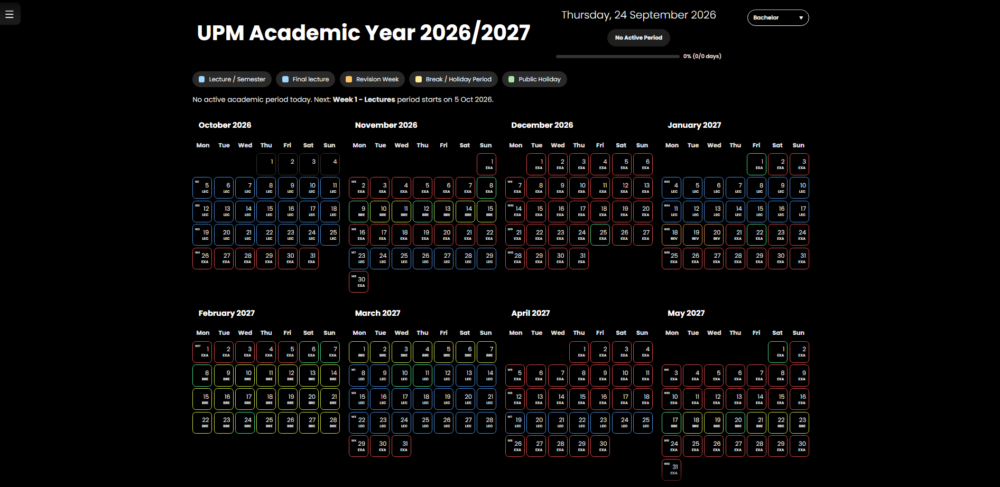
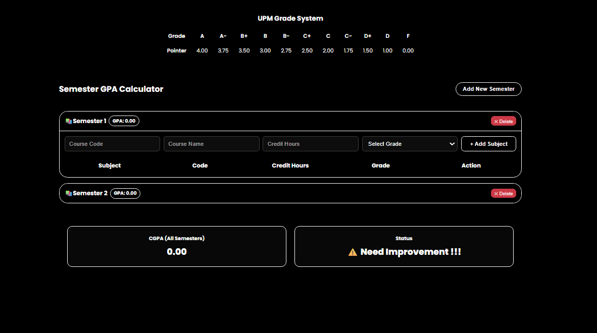
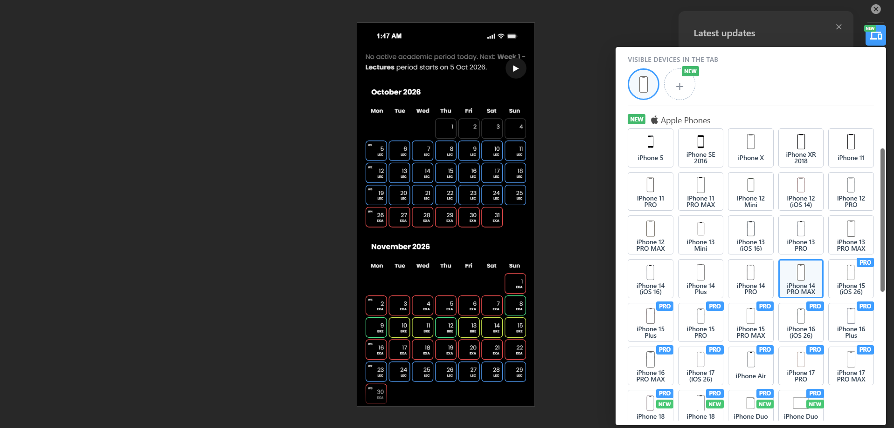
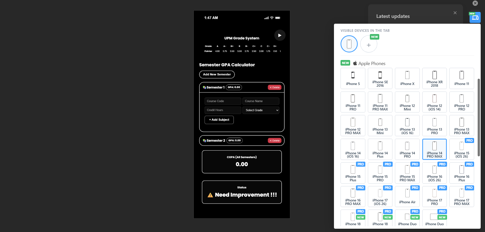

# UPM Academic Calendar & GPA Calculator

A Progressive Web App (PWA) that displays the **UPM Academic Calendar for 2026/2027** alongside a **GPA / CGPA Calculator**. Built with vanilla HTML, CSS, and JavaScript, no frameworks, no build step.

Live site: [https://putracalendar.vercel.app](https://putracalendar.vercel.app)

``

``

``

``

## Table of Contents

- [Features](#features)
- [Tech Stack](#tech-stack)
- [Screenshots](#screenshots)
- [Project Structure](#project-structure)
- [Running Locally](#running-locally)
- [Updating the Calendar](#updating-the-calendar-yearly)
- [Cache Busting](#important-cache-busting)
- [Installing as an App](#installing-as-an-app)
- [GPA Grade Reference](#gpa-grade-reference)
- [Known Limitations](#known-limitations)
- [Roadmap](#roadmap)
- [Browser Support](#-browser-support)
- [FAQ](#faq)
- [Privacy](#privacy)
- [Credits](#credits)
- [License](#license)
- [Contributing](#contributing)

---

## Features

### Academic Calendar

- Monthly grid view covering the full 2026/2027 academic year
- Color-coded periods:
  - 🔵 Lecture weeks
  - 🔴 Exam weeks (Test I, Test II, Final Exam)
  - 🟠 Revision weeks
  - 🟡 Semester breaks
  - 🟢 Public holidays
- Study level toggle to switch between:
  - Bachelor (Semester 1 & )
  - ASPer / Foundation (Semester 1 & 2)
- Week numbers (W1, W2, …) displayed on Mondays
- Click any date to see a slide-up info panel with the period and holiday details
- Auto-scrolls to today's date on load
- Live semester progress bar (% of semester completed, excluding mid-sem breaks)
- Countdown to final exams

### GPA Calculator

- Add / delete unlimited semesters
- Add subjects with course code, name, credit hours, and grade
- Full UPM grade system (A → F with correct pointers)
- Per-semester GPA + overall CGPA
- Automatic status indicator:
  - `4.00` → ANC Award
  - `≥ 3.75` → Dean's List
  - `≥ 3.00` → Good Standing
  - `≥ 2.00` → Satisfactory
  - `< 2.00` → Need Improvement
- Data persists via `localStorage` (survives refresh)

### Progressive Web App

- Installable on mobile & desktop
- Works offline via service worker caching
- Custom app icons + web manifest

### Extras

- Collapsible sidebar navigation
- Live digital clock in the sidebar
- Background music player ("Serdang oh Serdang") with progress bar
- Fully responsive: mobile, tablet, and desktop layouts

---

## Tech Stack

| Layer   | Technology                                     |
| ------- | ---------------------------------------------- |
| Markup  | HTML5                                          |
| Styling | Vanilla CSS (custom properties, grid, flexbox) |
| Logic   | Vanilla JavaScript (ES6+)                      |
| Storage | `localStorage`                               |
| Offline | Service Worker + Cache API                     |
| Fonts   | Google Fonts (Poppins, Inter)                  |
| Hosting | Vercel                                         |

No npm, no bundler, no framework, just open `index.html`.

---

## Screenshots

### Calendar View

### GPA Calculator

### Calendar Mobile View

  

### Calendar GPA View

  

---

## Project Structure

websiteUPM/
├── index.html # Main HTML entry point
├── style.css # All styling
├── script.js # Calendar data, GPA logic, UI rendering
├── pwa.js # Service worker registration
├── sw.js # Service worker (offline caching)
├── site.webmanifest # PWA manifest
├── favicon.ico
├── favicon-16x16.png
├── favicon-32x32.png
├── apple-touch-icon.png
├── android-chrome-192x192.png
├── android-chrome-512x512.png
└── music.mp3 # Background audio (not included in repo)

> **Note:** `music.mp3` is not tracked in the repo. Add your own audio file with that exact filename to enable the music player locally.

---

## Updating the Calendar (Yearly)

All academic data lives in  **`script.js`** . When the new academic year is released, edit these three arrays:

1. **`academicPeriods`** — lecture / exam / revision / break weeks per level
2. **`publicHolidays`** — Malaysian public holidays
3. **`midSemesterBreaks`** — start & end dates for each mid-sem break

Also update the hardcoded semester boundaries in these functions:

* `getSemesterProgress()`
* `getSemesterLabel()`
* `getSemesterStartDate()`
* `renderCalendarSummary()`

Then update the semester dates in `renderCalendar()` (month range for each level).

---

## Important: Cache Busting

This project uses a service worker (`sw.js`) that aggressively caches assets. If you update your site and users still see the  **old version** , it's almost always the cache, not Vercel, not the user's browser.

Fix: Every time you deploy significant changes, bump the cache version in `sw.js`:

// Before
const CACHE_NAME = 'upm-pwa-v1';

// After
const CACHE_NAME = 'upm-pwa-v2';

The `activate` event will automatically delete old caches and users will get the new version on their next visit.

Full cache-refresh checklist after a deploy:

1. ✅ Confirm Vercel shows the deployment as `Ready` + `Production`
2. ✅ Manually assign the custom domain to the new deployment if needed:
   * Vercel → Deployments → latest → `...` → Assign Domain
3. ✅ Bump `CACHE_NAME` in `sw.js` if assets changed
4. ✅ Hard-refresh (`Ctrl + F5`) or test in Incognito to bypass browser cache

---

## Installing as an App

* Android (Chrome): Menu → *Add to Home screen*
* iOS (Safari): Share → *Add to Home Screen*
* Desktop (Chrome/Edge): Install icon in the address bar

---

## GPA Grade Reference

| Grade | Pointer | Grade | Pointer |
| ----- | ------- | ----- | ------- |
| A     | 4.00    | C+    | 2.50    |
| A-    | 3.75    | C     | 2.00    |
| B+    | 3.50    | C-    | 1.75    |
| B     | 3.00    | D+    | 1.50    |
| B-    | 2.75    | D     | 1.00    |
|       |         | F     | 0.00    |

GPA = Σ (Grade Point × Credit Hours) ÷ Σ (Credit Hours)

---

## Credits

DEV 4C 55 4C 55

**Built for UPM students, by a UPM student.**

---

## License

This project is for educational and personal use. Academic calendar data belongs to  Universiti Putra Malaysia (UPM) . Verify all dates against the official UPM academic calendar before relying on them.

---

## Contributing

Found a bug or wrong date? Open an issue or submit a pull request:

1. Fork the repo
2. Create a branch: `git checkout -b fix/wrong-exam-date`
3. Commit: `git commit -m "fix: correct Sem 1 final exam week"`
4. Push: `git push origin fix/wrong-exam-date`
5. Open a Pull Request

---

## Known Limitations

- Calendar data is manually entered, always verify against the official UPM calendar
- Public holiday dates for 2027 may shift once officially announced
- Service worker caches aggressively, see Cache Busting section

---

## Roadmap

- [ ] Dark / light theme toggle
- [ ] Countdown widget on home screen
- [ ] Push notifications for exam weeks

---

## FAQ

**Q: Why is my calendar showing old data?**
A: Clear your browser cache or hard-refresh (Ctrl+F5). The service worker caches aggressively.

**Q: Is my GPA data saved online?**
A: No, it's stored locally in your browser via `localStorage`. Clearing browser data will erase it.

**Q: Can I use this for other universities?**
A: The calendar data is UPM-specific, but you can edit `academicPeriods` in `script.js` for any institution.

---

## 🌐 Browser Support

| Browser           | Supported |
| ----------------- | --------- |
| Chrome / Edge     | ✅        |
| Firefox           | ✅        |
| Safari (iOS 14+)  | ✅        |
| Samsung Internet  | ✅        |
| Internet Explorer | ❌        |

---

## Privacy

This app does **not** collect any data. All GPA information stays on your device
(via `localStorage`). No analytics, no tracking, no server.

---

## Acknowledgements

- Fonts by [Google Fonts](https://fonts.google.com)
- Icons inspired by Material Design
- Semester structure based on UPM's official academic calendar

## **If this helped you, consider giving the repo a star! THANK YOU**
